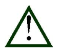

# Unboxing and setting-up the device

The device is delivered to the user pre-assembled and boxed.

The user must connect the components and perform a setup before the
first use (see: **5 System setup**)*.* The unboxing of the device should
be performed with utmost care.

 | If the device was placed in an environment with climatic conditions that sharply diverge from normal office conditions, it should undergo a process of acclimatization before the first use. This comprises of leaving the device out of the transport packaging for a minimum of 12 hours.
-|-

[The packaging should include:]{.underline}

-   **us4R™** device (with probe adapter) -- 1 pcs.;

-   PC system controller -- 1 pcs.;

-   PCIe cables -- 4 or 8 pcs.;

-   mains power cable -- 1 pcs.;

-   (optional) ultrasound probe(s).

In case of any missing items, the Customer is advised to contact the
Manufacturer.

Before the first use, it is necessary to ensure that the room has ample
space, stable ground and 120/230VAC mains power source with a protective
bonding.

The device should be placed to facilitate a safe operation: the power
cables must be neither strained nor hanging too loose in a manner that
may lead to tripping, wrenching out of cables or otherwise damaging them
through breaking or cutting.

Procedures using the **us4R™** should not be performed if the device is
in proximity to another working ultrasound device. Ultrasound probes can
cause interference, resulting in a falsification of the image.

A proper operation of the device is described in the next chapters of
this manual.

 | The power cables should be plugged into the 120-230VAC/50Hz/60Hz mains power supply with a protective bonding.
-|-

## Probe Adapters

Several adapters are available for use with the **us4R™** system. Please
consult the list of adapters as shown below:

+---------+-------------------------+---------------------------------+
| Op      | Probes compatibility    | Probe Adapters                  |
| tions\* |                         |                                 |
+=========+=========================+=================================+
| -128RX\ | up to 128-element       | PAU (Ultrasonix Probe Adapter)  |
| (4x     | probes                  |                                 |
| us4OEM) | (linear/phase/convex)   | VPA (ATL/Philips Probe Adapter) |
|         |                         |                                 |
|         |                         | Custom Probe Adapter (on        |
|         |                         | request)                        |
+---------+-------------------------+---------------------------------+
| -192RX\ | up to 192-element       | EPA (Esaote Probe Adapter)\*\*  |
| (6x     | probes                  |                                 |
| us4OEM) | (linear/phase/convex)   | PAU (Ultrasonix Probe           |
|         |                         | Adapter)\*\*                    |
|         |                         |                                 |
|         |                         | VPA (ATL/Philips Probe          |
|         |                         | Adapter)\*\*                    |
|         |                         |                                 |
|         |                         | Custom Probe Adapter (on        |
|         |                         | request)                        |
+---------+-------------------------+---------------------------------+
| -256RX\ | up to 256-element       | PAU (Ultrasonix Probe Adapter)  |
| (8x     | probes                  |                                 |
| us4OEM) | (linear/phase/convex)\  | VPA (ATL/Philips Probe Adapter) |
|         | and\                    |                                 |
|         | up to 1024-element\     | EPA (Esaote Probe Adapter)      |
|         | matrix-array probes     |                                 |
|         |                         | 2D MATRIX 2372 Vermon probe     |
|         |                         |                                 |
|         |                         | Custom Probe Adapter (on        |
|         |                         | request)                        |
+---------+-------------------------+---------------------------------+

*\* Switching between 4x, 6x and 8x us4OEM module options can be done by
the Manufacturer only.*

*\*\* Not easily interchangeable! If you plan to use probes above 128
elements from various manufacturers\
(e.g. Esaote and Philips probes) please contact us4us to find the best
solution for you.*

If you cannot find the adapter that suits your application, it is
possible to order a custom probe adapter from the us4us®. Please contact
us at <support@us4us.eu> to discuss the options.

# Power supply connection

 | The 120-230VAC power socket used to power the us4R™ must be equipped with a protective earth wire. It is imperative to ensure that the electrical system provides the fire protection required for the class I devices.
-|- 

A loss of mains power during operation will result in an immediate
shutdown of the device. The **us4R™** will restart once the power is
restored.

 | To shut down the us4R™ in case of malfunction, remove the mains power cable from the electrical socket. The electrical sockets should be situated in proximity to the device and be easily accessible.
-|- 

# System setup

The **us4R™** should be positioned so that operation is safe --- i.e. on
a stable, flat surface in a place with no risk of spillage on the device
and away from the sources of interference and radiation. The external
power supply and power strip should be placed nearby. For more details
see section: **6 Description and general rules of use.**

The heat is dissipating by the us4R-3D system during normal work
conditions and may slightly increase the temperature of the device
surroundings. The ventilation holes on each side of the device must
remain uncovered to ensure free flow of air. Covering the ventilation
holes risks overheating, shutting down or damaging the **us4R™.** The
power and probe cables must not be strained or hang too loosely in a
manner that may lead to tripping, mechanical damage, wrenching the
cables out of the socket and/or damaging them through breaking or
cutting. The audio frequency noise is coming from the fans and sometimes
from the HV power supply during transmit during normal work conditions.
Please consult the Manufacturer guidelines in section **7 Manufacturer
guidelines and conditions of use.**

## Power switch, cables and ON/OFF button

The power cables connection is shown in the picture below.

Fig. 6.8 The us4R™ AC power connector.

## First use

Before first use of the **us4R™**, you must ensure that:

-   the device has been set up according to Manufacturer guidelines
    found in section **5 System setup**,

-   proper probe adapter has been installed,

-   an external PC and monitor have been connected to the **us4R™**.

Step-by-step instruction:

1.  Connect the mains to the **us4R™** and turn the *Power Switch*
    on***.***

2.  Now, turn on the device by clicking the ON/OFF button.

3.  Connect the ultrasound probe.

4.  Turn on the host PC

    a.  Before login check the color of the LEDs on the back of the PC
        -- all 4 or 8 LED indicators (from the top and bottom card)
        should light up GREEN.

Fig. 6.9 The host PC: the PCIe card interface with four connected PCIe cables and the PCIe links LEDs.

>IMPORTANT NOTE: If any of the LED indicators light up ORANGE, please reboot the PC. Keep rebooting until all LEDs are green.

5.  Log in to the host PC:

    `user: us4us`
    
    `password: us4us`

6.  Make sure to check that the device and its software is starting
    correctly. If any errors are signaled by the device or messages
    displayed on screen, proceed according to instructions.

7.  Install the ARRUS package according to instructions available
    [here](https://us4useu.github.io/arrus-public/releases/current/python/content/installation/index.html#arrus)
    (if it is not already installed).

8.  Follow the instruction on how to run "plane wave imaging" example
    script available
    [here](https://us4useu.github.io/arrus-public/releases/develop/python/content/examples.html)

(section Examples → Plane Wave Imaging). Please remember to use the
configuration file provided.

+-------+--------------------------------------------------------------+
| > {wid |                                                              |
| th="0 |                                                              |
| .6405 |                                                              |
| 51181 |                                                              |
| 10236 |                                                              |
| 22in" |                                                              |
| >     |                                                              |
| heigh |                                                              |
| t="0. |                                                              |
| 59370 |                                                              |
| 07874 |                                                              |
| 01574 |                                                              |
| 8in"} |                                                              |
+=======+==============================================================+
+-------+--------------------------------------------------------------+

9.  Once the test is over, close the image window.

10. The host PC can now be turned off by shutting down the Windows
    system as normal.

11. Turn off the **us4R™** by pressing the ON/OFF button.

12. After 5 seconds turn off the Power Switch.
