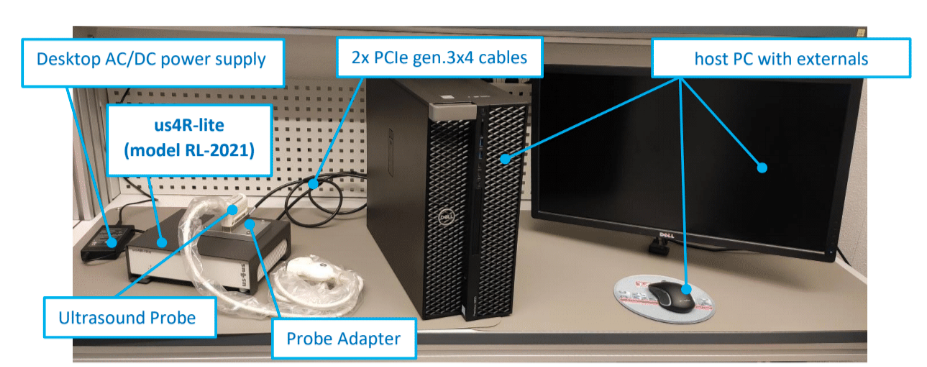

# System Overview

## Principle of operation

The us4R-lite™ system is available in two model versions: a peripheral mode where it is paired with an external Host PC through Thunderbolt (model RL_2020) and peripheral mode where it is paired with an external Host PC through PCIe (model RL_2021).

The us4R-lite™ is connected using a certified Thunderbolt-3 or PCIe cable to a PC/notebook running ARRUS™ SDK. User’s applications/scripting is used to program the device, acquire the data, and perform custom processing.

